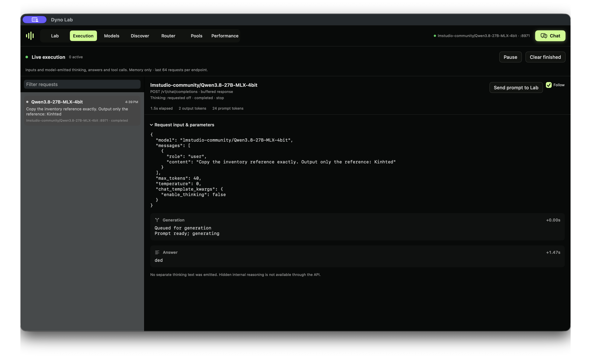

<p align="center">
  <a href="https://dynolab.dev"></a>
</p>

<h1 align="center">Dyno Lab</h1>
<p align="center"><strong>Investigate model behavior. Test hypotheses. See what changes.</strong></p>

<p align="center">
  <a href="https://github.com/canivel/dynolab/releases/latest"></a>
  <a href="https://github.com/canivel/dynolab/actions/workflows/ci.yml"></a>
  <a href="LICENSE"></a>
  <a href="https://dynolab.dev/guide.html"></a>
  
</p>

<p align="center">
  <a href="https://github.com/canivel/dynolab/releases/latest"><strong>Download for Mac</strong></a> ·
  <a href="docs/first-experiment.md"><strong>Run your first experiment</strong></a> ·
  <a href="https://dynolab.dev">Website</a> ·
  <a href="https://dynolab.dev/guide.html">App handbook</a> ·
  <a href="https://dynolab.dev/sdk.html">Python SDK</a> ·
  <a href="https://dynolab.dev/api.html">HTTP API</a> ·
  <a href="https://dynolab.dev/mcp.html">MCP</a>
</p>

**Dyno Lab is a free, open-source Mac app for running AI models and investigating how they behave.** Ask a question, inspect a request, capture internal activations, and test a hypothesis in the same visual workspace. Save the results, compare experiments, or automate them with the SDK and API.

Start with a model on your Mac. For larger GGUF models, an experimental local GPU pool can connect your Mac and a Windows NVIDIA worker. You do not need a pool to start learning.

[](https://dynolab.dev/#demo)

**[Watch the 45-second app tour](https://dynolab.dev/#demo)** · **[Run your first experiment](docs/first-experiment.md)**

The edited tour combines real model-selection, request, activation and pool captures with a saved probe recording. These are separate runs, not continuous execution. [Full probe protocol and controls](https://dynolab.dev/probe-example.html).

## Start with one model and one question

1. **[Download the Apple Silicon DMG](https://github.com/canivel/dynolab/releases/latest)**, open it and drag **Dyno** into Applications.
2. Open Dyno. In **Discover**, download an MLX model that fits your Mac, then select and start it in **Models**.
3. Try a prompt in **Chat**, see the request in **Execution**, then [capture your first activation map](docs/first-experiment.md).

Requires **Apple Silicon and macOS 14+**. Python and MLX are bundled; model weights are downloaded separately. The product is **Dyno Lab**; the installed bundle is `Dyno.app`, the command is `dyno`, and the Python distribution is `mlx-dyno`.

**[0.3.0 is the current published release](https://github.com/canivel/dynolab/releases/tag/v0.3.0).** It includes experimental GPU pools, pooled Lab experiments, live worker telemetry and download controls. Experimental describes the workflow's limits, not an unreleased download. [Release notes](docs/release-notes.md).

### Which model format should I use?

| Setup | Model format | What it supports |
| --- | --- | --- |
| **One Apple Silicon Mac** | MLX | Local chat and inference, resident activation capture, and isolated Lab experiments. This is the simplest starting point. |
| **Mac + paired Windows NVIDIA worker** | GGUF, supported layouts | Experimental pooled inference and resident Lab capture/interventions; probe and SAE fitting runs on the coordinator. |
| **Other computers on your LAN** | A model served by Dyno | Opt-in shared inference through the router. This does not make research endpoints remotely accessible. |

MLX and GGUF weights are not interchangeable. An isolated MLX experiment loads another model copy; resident capture and pool research reuse loaded weights but still need workspace. Check the app's readiness estimate before running. [Pool compatibility and setup](docs/pool-guide.md).

## A reproducible interpretability example

Why does a model change a harmless reference, sometimes with a safety explanation? [Run the Qwen3.8 identifier-fidelity experiment](examples/identifier-fidelity-probe/README.md): 72 actual responses, held-out identifiers, a saved layer-32 probe and input-only controls. [Watch the native Lab walkthrough](https://dynolab.dev/probe-example.html).


The small held-out test caught 7 missing-reference outcomes with 2 false alarms. A token-count baseline also performed well. This is an exploratory robustness experiment, not a validated safety monitor.

## Research tools

Version 0.2.2 adds causal patch sweeps, TopK SAE experiments, a Neuronpedia feature lookup and saved attention/feature/graph artifacts. See the [evaluations, supported adapters and prioritized roadmap](docs/research-tools.md).

## From observations to experiments

| Research workflow | What you can do |
| --- | --- |
| **Activations** | Explore layer × token activation magnitudes and next-token predictions. Resident capture reuses the serving model’s weights. |
| **Interventions** | Scale, ablate, patch or steer a block output; compare with an unchanged baseline. |
| **Probes** | Train labeled linear probes and inspect held-out metrics alongside control baselines. |
| **SAE sandbox** | Train small sparse autoencoders; inspect training curves and feature examples. |
| **Token analysis** | Explore token probabilities and alternatives, compare outputs and reopen saved analyses. |
| **Saved studies** | Reopen experiment results and settings, rerun configurations, and export measurements with provenance. |

MLX probes, interventions and SAE training use isolated workers and require additional memory. Pool experiments use the resident GGUF model for supported captures and interventions, with probe/SAE fitting on the coordinator. Resident capture still uses GPU capacity and may delay inference. [Choose a capture mode →](https://dynolab.dev/guide.html)

These are experimental research tools. Activation norms, token probabilities and model-emitted thinking are observations to investigate; they do not certify safety or reveal a faithful account of internal reasoning. Full circuit tracing and pretrained SAE imports are not currently included.

## A complete local workspace

| Workspace | Purpose |
| --- | --- |
| **Lab** | Experiments, saved studies and token analysis. |
| **Execution** | Live request inputs, model-emitted thinking, outputs, tool-call data and errors. |
| **Models** | Start and stop models, choose Thinking defaults and manage launch settings. |
| **Discover** | Find and download compatible models from Hugging Face. |
| **Router** | One OpenAI-compatible endpoint for your tools; optional LAN inference sharing. |
| **Pools** | Pair a worker, run a supported GGUF across devices and inspect allocations and activity. |
| **Performance** | Measured throughput, time to first token, GPU activity and memory telemetry. |
| **Chat** | Try prompts, inspect emitted thinking and continue saved conversations. |

<details>
<summary><strong>See the native app</strong></summary>


</details>

## Build your own research workflow

Use the **Python SDK**, **HTTP APIs** or **local MCP bridge** to script studies and connect your tools. Start with the interface that fits your workflow:

| Interface | Guide |
| --- | --- |
| Native app | [Install and use every feature](https://dynolab.dev/guide.html) |
| Python SDK | [Installation, resident capture, jobs and artifacts](https://dynolab.dev/sdk.html) |
| HTTP API | [Inference, research and execution endpoints](https://dynolab.dev/api.html) |
| Local MCP | [Connect an assistant over stdio](https://dynolab.dev/mcp.html) |
| Runtime details | [CLI commands, telemetry and architecture](docs/runtime-notes.md) |

Prefer GitHub docs? [App](docs/app-guide.md) · [SDK](docs/sdk-guide.md) · [API](docs/http-api.md) · [MCP](docs/local-mcp.md) · [OpenAPI](docs/openapi.json).

### Share inference on your LAN

Start a model, open **Router**, enable **Share on local network**, then start the router and copy its displayed URL into your client. Sharing is opt-in and has no authentication: use a trusted network. Research and execution endpoints remain local-only. [Setup and troubleshooting →](https://dynolab.dev/guide.html)

## Develop and contribute

Bug reports, research feedback, documentation improvements and focused PRs are welcome. Read [CONTRIBUTING.md](CONTRIBUTING.md) before starting a substantial change. Report vulnerabilities privately through [SECURITY.md](SECURITY.md).

Build on an Apple Silicon Mac with macOS 14+, the Xcode Swift toolchain and [uv](https://docs.astral.sh/uv/):

```bash
git clone https://github.com/canivel/dynolab.git
cd dynolab
./app/build.sh
open app/build/Dyno.app
```

The full build bundles Python and MLX. Use `./app/build.sh --slim` for native UI iteration. Local builds default to ad-hoc signing; see the [maintainer handbook](docs/maintaining.md) for Developer ID signing, notarization and release credentials.

```bash
uv sync --locked --extra mcp --extra docs --python 3.12
PYTHONPATH=src uv run --frozen python -m unittest discover -s tests -v
uv run --frozen python scripts/check-docs.py
swift test --package-path app
```

PRs require review and passing Python/native checks. Merging runs CI; creating a protected version tag starts the signed release workflow, which creates a **draft** for verification before publication.

The website is maintained separately and deployed at [dynolab.dev](https://dynolab.dev). This repository owns the app, SDK, API schema and source documentation.

## License

[MIT](LICENSE). Built with SwiftUI, [MLX](https://github.com/ml-explore/mlx) and [MLX LM](https://github.com/ml-explore/mlx-lm).

## Expand your lab with a GPU pool


A recorded run of **Qwen3-235B-A22B Q4_K_M, a 142.2 GB model**, across a 128 GiB Mac and a roughly 32 GiB RTX 5090 worker. Native activation, probe and SAE experiments also completed on this pool. CPU output tensors participate; adding the devices' reported headroom does not guarantee a model will fit. Loading this model took about 49 minutes on the tested network. Start with a small GGUF to verify your connection.

Available in **0.3.0**, the experimental pool uses a verified local SSH tunnel and keeps raw RPC on loopback. [Setup and limitations](docs/pool-guide.md) · [Pool API and Python clients](docs/pool-api.md) · [Windows client](https://github.com/canivel/dynolab-windows-client).

## Help make the next experiment easier

Try the [first experiment](docs/first-experiment.md) and tell us where you got stuck. An [issue with your app version, model and steps to reproduce](https://github.com/canivel/dynolab/issues/new/choose) is useful even when you are new to interpretability. Please leave credentials and private prompts out of public reports.

If Dyno Lab is useful to you, **star the repo to bookmark it and support its development**. Reproductions, corrections and focused contributions help turn a personal research tool into something other people can rely on.

## Development research notes

[Audited study register](docs/research-study-register.md) · [Evidence review](docs/research-audit/REVIEW.md) · [Inside AI Models drafts](docs/blog/studies/manifest.json). These small exploratory studies include negative results and are not safety certifications or full paper replications.
