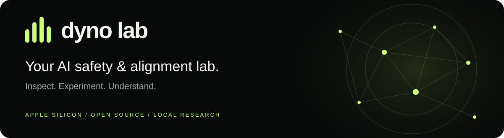

<p align="center">
  <a href="https://dynolab.dev"></a>
</p>

<h1 align="center">Dyno Lab</h1>
<p align="center"><strong>Investigate model behavior. Test hypotheses. See what changes.</strong></p>

<p align="center">
  <a href="https://github.com/canivel/dynolab/releases/latest"></a>
  <a href="https://github.com/canivel/dynolab/actions/workflows/ci.yml"></a>
  <a href="LICENSE"></a>
  <a href="https://dynolab.dev/guide.html"></a>
  
</p>

<p align="center">
  <a href="https://github.com/canivel/dynolab/releases/latest"><strong>Download for Mac</strong></a> ·
  <a href="https://dynolab.dev">Website</a> ·
  <a href="https://dynolab.dev/guide.html">App handbook</a> ·
  <a href="https://dynolab.dev/sdk.html">Python SDK</a> ·
  <a href="https://dynolab.dev/api.html">HTTP API</a> ·
  <a href="https://dynolab.dev/mcp.html">MCP</a>
</p>

Dyno Lab is a native Mac workbench for **AI safety, alignment and mechanistic interpretability research**. Explore activations, train probes, run small SAE experiments and compare interventions, with saved results and a programmable research interface.

Local MLX inference is the foundation. Run models on Apple Silicon, inspect requests as they execute, and track the memory and GPU capacity your experiments need.


A real 142.2 GB model running across a 128 GiB Mac and a 32 GiB NVIDIA worker. CPU output tensors participate; reported memory headroom is not reserved capacity. [Reproduce the setup](docs/pool-guide.md).


*Recorded native app views of real Qwen 0.5B experiments. This walkthrough cycles through saved results; it is not a live generation recording.*

## Start your lab

1. **[Download the latest Apple Silicon DMG](https://github.com/canivel/dynolab/releases/latest)**, open it and drag **Dyno** into Applications.
2. Open the app from its menu bar icon. In **Discover**, download an MLX model that fits your Mac.
3. In **Models**, choose your Thinking preference and start the model.
4. Open **Lab → Experiments → Activations → Inspect serving model** to explore the loaded model, or use **Chat** to try a prompt.

Requires **Apple Silicon and macOS 14+**. Python and MLX are bundled; model weights are downloaded separately. The product is **Dyno Lab**; the installed bundle is still `Dyno.app`, the command is `dyno`, and the Python distribution is `mlx-dyno`.

**New in 0.3.0:** A local GPU pool for larger GGUF models, pooled Lab experiments, live worker telemetry and download controls. [Release notes →](docs/release-notes.md)

## Research tools

Version 0.2.2 adds causal patch sweeps, TopK SAE experiments, a Neuronpedia feature lookup and saved attention/feature/graph artifacts. See the [evaluations, supported adapters and prioritized roadmap](docs/research-tools.md).

## From observations to experiments

| Research workflow | What you can do |
| --- | --- |
| **Activations** | Explore layer × token activation magnitudes and next-token predictions. Resident capture reuses the serving model’s weights. |
| **Interventions** | Scale, ablate, patch or steer a block output; compare with an unchanged baseline. |
| **Probes** | Train labeled linear probes and inspect held-out metrics alongside control baselines. |
| **SAE sandbox** | Train small sparse autoencoders; inspect training curves and feature examples. |
| **Token analysis** | Explore token probabilities and alternatives, compare outputs and reopen saved analyses. |
| **Saved studies** | Reopen experiment results and settings, rerun configurations, and export measurements with provenance. |

Probes, interventions and SAE training use isolated workers and require additional memory. Resident activation capture avoids a second weight copy but still uses GPU capacity and may delay inference. [Choose a capture mode →](https://dynolab.dev/guide.html)

These are experimental research tools. Activation norms, token probabilities and model-emitted thinking are observations to investigate; they do not certify safety or reveal a faithful account of internal reasoning. Full circuit tracing and pretrained SAE imports are not currently included.

## A complete local workspace

| Workspace | Purpose |
| --- | --- |
| **Lab** | Experiments, saved studies and token analysis. |
| **Execution** | Live request inputs, model-emitted thinking, outputs, tool-call data and errors. |
| **Models** | Start and stop models, choose Thinking defaults and manage launch settings. |
| **Discover** | Find and download compatible models from Hugging Face. |
| **Router** | One OpenAI-compatible endpoint for your tools; optional LAN inference sharing. |
| **Performance** | Measured throughput, time to first token, GPU activity and memory telemetry. |
| **Chat** | Try prompts, inspect emitted thinking and continue saved conversations. |

<details>
<summary><strong>See the native app</strong></summary>


</details>

## Build your own research workflow

Use the **Python SDK**, **HTTP APIs** or **local MCP bridge** to script studies and connect your tools. Start with the interface that fits your workflow:

| Interface | Guide |
| --- | --- |
| Native app | [Install and use every feature](https://dynolab.dev/guide.html) |
| Python SDK | [Installation, resident capture, jobs and artifacts](https://dynolab.dev/sdk.html) |
| HTTP API | [Inference, research and execution endpoints](https://dynolab.dev/api.html) |
| Local MCP | [Connect an assistant over stdio](https://dynolab.dev/mcp.html) |
| Runtime details | [CLI commands, telemetry and architecture](docs/runtime-notes.md) |

Prefer GitHub docs? [App](docs/app-guide.md) · [SDK](docs/sdk-guide.md) · [API](docs/http-api.md) · [MCP](docs/local-mcp.md) · [OpenAPI](docs/openapi.json).

### Share inference on your LAN

Start a model, open **Router**, enable **Share on local network**, then start the router and copy its displayed URL into your client. Sharing is opt-in and has no authentication: use a trusted network. Research and execution endpoints remain local-only. [Setup and troubleshooting →](https://dynolab.dev/guide.html)

## Develop and contribute

Bug reports, research feedback, documentation improvements and focused PRs are welcome. Read [CONTRIBUTING.md](CONTRIBUTING.md) before starting a substantial change. Report vulnerabilities privately through [SECURITY.md](SECURITY.md).

Build on an Apple Silicon Mac with macOS 14+, the Xcode Swift toolchain and [uv](https://docs.astral.sh/uv/):

```bash
git clone https://github.com/canivel/dynolab.git
cd dynolab
./app/build.sh
open app/build/Dyno.app
```

The full build bundles Python and MLX. Use `./app/build.sh --slim` for native UI iteration. Local builds default to ad-hoc signing; see the [maintainer handbook](docs/maintaining.md) for Developer ID signing, notarization and release credentials.

```bash
uv sync --locked --extra mcp --extra docs --python 3.12
PYTHONPATH=src uv run --frozen python -m unittest discover -s tests -v
uv run --frozen python scripts/check-docs.py
swift test --package-path app
```

PRs require review and passing Python/native checks. Merging runs CI; creating a protected version tag starts the signed release workflow, which creates a **draft** for verification before publication.

The website is maintained separately and deployed at [dynolab.dev](https://dynolab.dev). This repository owns the app, SDK, API schema and source documentation.

## License

[MIT](LICENSE). Built with SwiftUI, [MLX](https://github.com/ml-explore/mlx) and [MLX LM](https://github.com/ml-explore/mlx-lm).

## Expand your lab with a GPU pool

The development preview connects a Mac coordinator and a native Windows NVIDIA worker over a verified local SSH tunnel. Supported GGUF models can distribute allocations across both devices, with per-device memory and live worker telemetry. [Setup and limitations](docs/pool-guide.md) · [Pool API and Python clients](docs/pool-api.md) · [Windows client](https://github.com/canivel/dynolab-windows-client). The development build has generated with Qwen3-235B-A22B Q4_K_M (142.2 GB) and passed the Lab API suite across Metal and RTX 5090. Native activation, probe and SAE runs also passed. Available in 0.3.0 as an experimental workflow.
