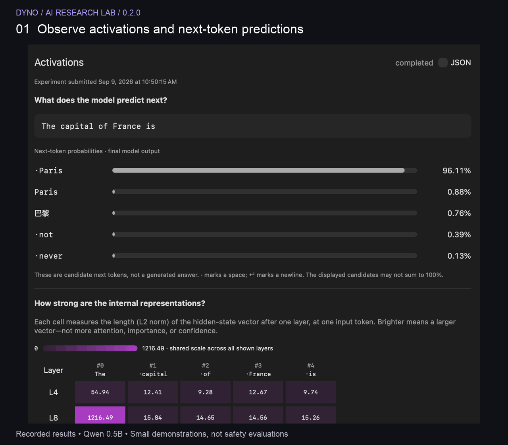
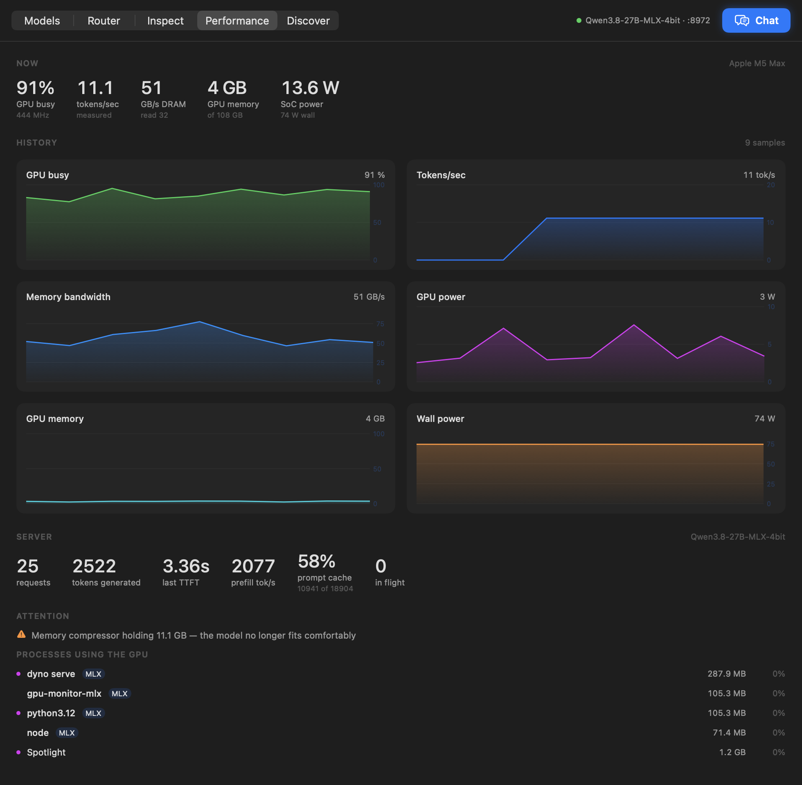
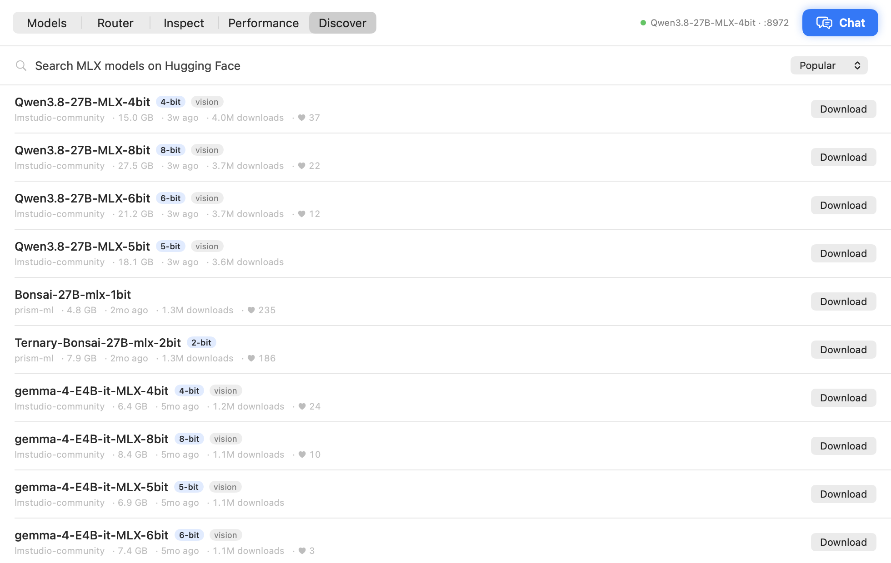

# MLX Dyno

**Your AI safety and alignment research lab.**

Investigate model behavior, test hypotheses, and visualize what changes.
Dyno brings activation exploration, linear probes, a small SAE sandbox, live
execution traces, and controlled intervention comparisons into one research
workbench—with a Python SDK, research API and local MCP tools for your own experiments.

Local model serving is the lab’s foundation: bundled MLX inference runs your
models on your Mac, alongside the hardware telemetry that helps you manage
experiments within its memory and GPU budget.

Research features are experimental: model-emitted thinking and interpretability
readouts are evidence to investigate, not a guarantee that a model is safe or aligned.

📖 **[canivel.github.io/mlx-dyno](https://canivel.github.io/mlx-dyno/)**

[**Download Dyno for Apple Silicon (.dmg)**](https://github.com/canivel/mlx-dyno/releases/latest)



*Recorded native app views of real Qwen 0.5B experiments. This walkthrough cycles through saved results; it is not a live generation recording.*

*Explore activations, train probes, and compare interventions with an unchanged baseline.*

| | What it is |
|---|---|
| **Dyno.app** | Native AI research workbench: inspect, probe, intervene and compare. |
| **`dyno lab` + `dyno.sdk`** | Isolated research jobs, saved artifacts, HTTP API and Python SDK. |
| **`dyno serve`** | The lab’s inference foundation: OpenAI-compatible MLX serving with throughput metrics. |
| **`dyno top`** | Hardware telemetry for understanding your experiments’ resource use. |

## What’s new in 0.2.0

Resident activation capture, readable predictions, automatic research history, Thinking controls, and detected-server Stop controls. See the [release notes](docs/release-notes.md).

## Research Lab

Lab is the default workspace. **Experiments → Activations** can inspect an
already-serving model without another weight copy, or run an isolated experiment.
Probes, interventions and SAE training use isolated jobs. **Token analysis** uses an existing serving
endpoint to inspect token probabilities and compare outputs, without loading a
second model. It still consumes inference capacity. Token probabilities do not
measure correctness or safety.

Open **Lab → Experiments** and choose a method. For Activations, choose
**Inspect serving model** to reuse loaded weights, or **Isolated experiment**
to load a separate copy. Isolated jobs require **Start lab**. Updated serving
endpoints expose resident capture after a one-time restart; Dyno never restarts
your inference server automatically. Activation heatmaps show layer/token structure; intervention
charts compare target-token probabilities and generated answers; probes report
held-out metrics and control baselines; the SAE sandbox displays training curves
and feature examples. Activation captures and token analyses save automatically on this Mac. Reopen history to restore results and settings; rerunning creates a new record. Export to share parameters and provenance.

The current scope is block-output analysis with raw-text prompts. Pretrained SAE
imports, full circuit tracing and automated safety certification are not included.

**[Website documentation](https://canivel.github.io/mlx-dyno/guide.html)** ·
[Python SDK & HTTP API](docs/research-api.md) · [Local MCP setup](docs/local-mcp.md)

Use `dyno mcp` to expose research tools to a local MCP client over stdio.
The updated app bundles a `Contents/MacOS/dyno-cli` launcher; source installs
use `pip install -e '.[serve,mcp]'`. The MCP bridge connects to an explicitly
started Lab service. It does not start experiments on connection.

## Why this exists

Understanding a model means connecting observations to experiments. Dyno keeps
inference, measurement and controlled changes in one local workflow, while exposing
the same research jobs to scripts. Its original hardware observability remains the
foundation: every experiment still runs within a real Mac's memory and GPU budget.


Running a large model locally on a Mac is mostly a memory problem, and the
tools do not show you memory the way it matters.

There is no `nvidia-smi` on macOS. Activity Monitor reports a GPU percentage
that cannot tell a GPU pinned at a low clock apart from one doing real work,
and reports memory used without reference to the only ceiling that counts: how
much unified memory Metal will actually let the GPU hold. On a 128 GB machine
that is 107.5 GB, not 128. Cross it and allocations quietly spill back to CPU
memory, throughput falls off a cliff, and nothing tells you why.

Then there is throughput itself. Token generation is memory-bound — every token
re-reads the entire weight set — so tokens per second is set by bandwidth, not
by GPU utilisation. A GPU reading 99% busy while pulling 250 GB/s and one
pulling 400 GB/s are different machines having very different days.

llama.cpp and vLLM both publish Prometheus metrics, so anyone can read their
real throughput. On Apple Silicon the fast path is MLX — and `mlx_lm` computes
throughput internally on every single request, then discards it. Anything
watching from outside has to infer it.

You can infer it, up to a point. Read bandwidth divided by weight-set size gives
the decode rate, and on a 27B 8-bit model on an M5 Max that predicted 8.97
tok/s against 8.70 measured: within 3%. But the moment a second request shared
the GPU, the same estimate read ~10.3 against 8.73 actual. An estimate that is
excellent in isolation and 18% high under load is not something to benchmark
against, tune a batch size with, or decide a quantisation level on.

So expose the number instead of guessing it. The measurement happens inside the
token stream, where it is simply a fact rather than an inference.

## Install

Download the **Apple Silicon DMG** from [GitHub Releases](https://github.com/canivel/mlx-dyno/releases/latest), open it, and drag **Dyno** into **Applications**.
Requires **macOS 14+ on Apple Silicon**. Python and MLX are included; model weights are downloaded separately in Discover.

The release is ad-hoc signed and **not Apple-notarized**. macOS may block its first launch; see [Apple's instructions](https://support.apple.com/guide/mac-help/mh40616/mac) before deciding whether to open it. Releases include a SHA-256 checksum.

### Build from source

**Requirements to build:** macOS 14+ on Apple Silicon, Xcode's Swift toolchain
(`xcode-select --install`), and [uv](https://docs.astral.sh/uv/) — which supplies
the Python that gets bundled. *The finished app needs none of these.*

```sh
git clone https://github.com/canivel/mlx-dyno
cd mlx-dyno/app
./build.sh                          # ~12 seconds, produces a 390 MB bundle
cp -r build/Dyno.app /Applications/
open /Applications/Dyno.app
```

That is the whole install. **Python and MLX ship inside the app**, so there is
nothing to `pip install` and no terminal needed afterwards.

Dyno lives in the menu bar — no Dock icon. **Click the menu bar icon to open
the app**; right-click it for a summary without leaving what you are doing.

## Using it

Six tabs — **Lab**, **Execution**, **Models**, **Discover**, **Router**, **Performance** — and a
**Chat** button at the top right (⌘J) that swaps the view for the conversation
and back again, leaving whichever tab you were on selected.

**Chat** — conversations on the left, the thread in the middle. Every reply
carries the tokens/sec and time to first token that produced it, read from the
server's counters rather than timed from outside. Reasoning models show their
thinking in a collapsible block, because mlx_lm reports it in its own field
rather than inline. The picker at the top selects the model, or a **Router** switch hands the
choice to the router instead — the reply then reports which model it actually
went to. Conversations are saved to disk and can be continued on a different
model than they started on.

**Execution**

Open **Execution** to watch requests sent by Chat, API clients, or other devices through Dyno's router. Select a request to see its input and generation parameters, routing decisions, model-emitted thinking, answer text, tool-call data, errors and finish reason. The view refreshes while generation runs; direct Dyno servers also expose token output before a non-streaming response finishes. Thinking is shown only when the model emits it; this is not access to hidden internal reasoning. Tool calls are displayed as emitted data, not executed by this viewer.

Pause freezes the view, while capture continues. Clear finished removes completed history. Each endpoint retains up to 64 requests in memory, with a 256 Ki-character / 1,024-step capture limit per request; truncated or uncaptured requests are marked. Nothing is written to disk. The `/executions` list, `/executions/<id>` detail and `DELETE /executions` clear endpoints are local-only, even when inference is shared over LAN. Restart model servers and the router after updating Dyno to enable capture. Other OpenAI-compatible runtimes can be inspected through the Dyno router; buffered upstream replies appear when they arrive.

**Models** — your library, with **Start**. Launch options are one disclosure
away: max tokens, prompt-cache size, decode and prompt concurrency, sampling
defaults, speculative decoding. Only settings you actually change are passed, so
untouched ones stay whatever mlx_lm considers correct.

**Performance** — GPU load, tokens/sec, memory bandwidth, GPU power, GPU memory
and wall power charted over time, with the server's own counters (requests,
tokens, TTFT, prefill rate, prompt-cache hit rate) and the processes competing
for the GPU.

**Router** — see below. Also where you point Continue, Aider, Zed or Cline at
your local models, in one click.

**Lab → Token analysis** — the model's token probabilities. Low-probability tokens, what it
nearly said instead, and — running two builds at the same seed — exactly which
token a quantisation changed. See below.

**Discover** — search the Hugging Face hub and download in one click.



*Performance keeps inference throughput and machine telemetry together.*



## Sharing models on your local network

1. Start a model in **Models**, then open **Router**.
2. Turn on **Share on local network** and click **Start the router**. If the
   router is already running, stop it first to change network access; your
   model servers can keep running.
3. Click **Copy URL** and use that address as the OpenAI-compatible base URL
   on another computer on the same network, for example
   `http://<MAC_LAN_IP>:8970/v1`. Use model `auto` to let Dyno choose, or a
   model ID returned by `/v1/models`. If your client requires an API key,
   enter `dyno`; the endpoint does not authenticate clients.
4. **Copy test** provides a ready-to-run curl request for the other computer.

Sharing is off by default each time the app opens. When enabled, the router
listens on all IPv4 interfaces (`0.0.0.0`); use it on a trusted network since
any device that can reach the port can submit inference requests. Router
settings, request history, backend details and metrics remain local-only.
Stop the router to stop sharing. Keep Dyno open and the Mac awake, allow incoming
connections if macOS asks, and refresh the addresses after changing networks.
Guest Wi-Fi or access-point isolation may prevent devices from connecting.

The command-line equivalent is `dyno route --host 0.0.0.0 --port 8970`.

The UI discovers this Mac's current network addresses automatically; there is
no address to hard-code in the app. **Refresh** updates them after a network
change. The sharing toggle takes effect when you click **Start the router**;
look for **Sharing is on** before testing from another computer.

To test from Bash on Linux or macOS, replace the placeholder with the URL
copied from Dyno:

```bash
BASE="http://<MAC_LAN_IP>:8970/v1"
curl --noproxy '*' --connect-timeout 5 "$BASE/models"
curl --noproxy '*' "$BASE/chat/completions" \
  -H 'Content-Type: application/json' \
  -d '{"model":"auto","messages":[{"role":"user","content":"Hello!"}],"max_tokens":128}'
```

From WSL, use `curl.exe` in place of `curl` to run the Windows client.
If Windows has both Ethernet and Wi-Fi and you need to select Wi-Fi, find
its IPv4 address under **Wireless LAN adapter Wi-Fi** in `ipconfig.exe`,
then add `--interface "<WINDOWS_WIFI_IP>"` to the `curl.exe` command.
Use the Windows Wi-Fi address for this option, not the Mac's address.

If a connection fails, run `lsof -nP -iTCP:8970 -sTCP:LISTEN` on the Mac
(or substitute your configured router port). Shared mode should show
`*:8970`, meaning all IPv4 interfaces. `127.0.0.1:8970` means local-only;
no result means the router is stopped. If the listener is correct, check
firewall rules and whether the network allows devices to reach each other.

## The router

```sh
dyno route
```

One OpenAI-compatible endpoint in front of every model you have running.
Point any client at `127.0.0.1:8970` with model `"auto"` and it picks.

What makes a *local* router different from OpenRouter is that the constraint is
memory, not money. Only two or three large models fit at once, reaching a
non-resident one costs tens of seconds of loading, and cost is measured in
seconds and watts. Dyno already knows which models are resident, how much
headroom is left and how fast each one actually runs, so it can decide on facts
rather than a price list.

Four mechanisms, in the order they get a say:

1. **Explicit rules** — readable and predictable, no model call. Match on
   length, a regex or a keyword; send to a tier or a named model.
2. **Self-routing** — the first turn goes to the strongest model, which then
   tags the conversation's difficulty; later turns follow the tag. The tagging
   call happens after the answer is already on its way back, so it costs the
   turn that pays for it nothing.
3. **Residency-aware cost** — among models clearing a tier, pick the one that
   will actually finish first, from measured throughput, queue depth and the
   load time a non-resident model would cost.
4. **Confidence escalation** — the model's own token probabilities say whether
   it was guessing. Below the threshold, retry on the next model up.

Every decision is recorded with the candidates it rejected and why, visible in
the Router tab or at `/routes`. A router you cannot interrogate is one you end
up switching off.

The policy is editable while it runs, from the Router tab or over HTTP — each
mechanism can be switched off, the escalation threshold moved, and rules added
or disabled. A policy you must restart to adjust is one nobody adjusts.

```sh
curl localhost:8970/config
curl -X POST localhost:8970/config -H 'Content-Type: application/json' \
  -d '{"escalate_below":0.68,"rules":[
        {"name":"code goes big","matches":"(refactor|debug|stack trace)","tier":"hard"}]}'
```

```
14:22:07  "Prove the halting problem is undecidable…"    8.6s
  ↗ Qwen3.8-27B-MLX-4bit   self-routing  easy  confidence 0.64
     escalated from Qwen1.5-0.5B-Chat —
     mean token probability 0.64 below 0.75
```

The escalation threshold is calibrated rather than round: measured on
Qwen1.5-0.5B, a question it handled well scored **0.95** and one well beyond it
scored **0.64**, so the default sits at 0.75 between them.

```sh
dyno route --list                        # what it can see, strongest first
dyno route --backend 8971 --backend 8972 # only these
dyno route --rules rules.json            # explicit rules
dyno route --escalate-below 0            # never escalate
dyno route --trace-file routes.jsonl     # append every decision
```

Under it all, an OpenAI-compatible endpoint on `127.0.0.1:8971` that any client
can point at.

Point any OpenAI client at it:

```sh
curl http://127.0.0.1:8971/v1/chat/completions \
  -H 'Content-Type: application/json' \
  -d '{"model":"<model>","messages":[{"role":"user","content":"hi"}]}'
```

Quit the app and the server stops with it, so a model is never left holding
tens of gigabytes.

<details>
<summary>Troubleshooting</summary>

`Dyno.app/Contents/MacOS/Dyno --diagnose` prints which runtime the app resolved
and which models it can see; add `--start` to actually launch the first one.

`--snapshot <dir>` renders the UI to PNG without launching the app.

`./build.sh --slim` skips the bundled runtime for faster rebuilds; a slim build
falls back to a `dyno` CLI on your `PATH`.

</details>

### Just the command line

The Python half stands alone, for scripting or a headless box:

```sh
uv tool install 'mlx-dyno[serve]'    # dyno pull / serve / top
uv tool install mlx-dyno             # dyno top only; rich is the sole dependency
```

## Serving from the command line

```sh
dyno serve --model mlx-community/Qwen3-8B-4bit --port 8971
```

```
MLX Dyno 0.1.0  ·  serving with live metrics
  OpenAI API   http://127.0.0.1:8971/v1
  Metrics      http://127.0.0.1:8971/metrics   (Prometheus)
  Stats        http://127.0.0.1:8971/stats     (JSON)
```

### Not a fork

`dyno serve` imports `mlx_lm.server`, swaps two classes for instrumented
subclasses, and hands control back. Every existing flag keeps working, and so do
mlx_lm's batching, prompt caching and speculative decoding. The additions are
timing hooks inside the token stream and two endpoints.

Hooking the token stream rather than the HTTP layer means streaming and
non-streaming requests are measured identically.

## The metrics

| Metric | Meaning |
|---|---|
| `mlx:decode_tokens_per_second` | In-flight throughput; falls back to recent history when idle |
| `mlx:live_decode_tokens_per_second` | Requests generating right now, summed |
| `mlx:last_time_to_first_token_seconds` | Prompt processing plus queue wait |
| `mlx:last_prompt_tokens_per_second` | Prefill throughput |
| `mlx:cached_prompt_tokens_total` | Prompt tokens the cache served |
| `mlx:tokens_generated_total`, `mlx:prompt_tokens_total` | Cumulative counters |
| `mlx:requests_active`, `mlx:requests_total`, `mlx:requests_failed_total` | Request state |
| `mlx:memory_active_bytes`, `_peak_bytes`, `_cache_bytes` | MLX allocator |
| `mlx:model_load_seconds`, `mlx:uptime_seconds` | Server state |

The decode rate deliberately excludes prompt processing and queue time: it is
tokens produced divided by the time spent producing them, which is the number
that answers "how fast does this model generate". Verified against wall-clock
timing — a request that took 5.46 s end to end with 0.36 s to first token
reported 31.2 tok/s, exactly `159 ÷ 5.10`.

`/stats` returns the same figures as JSON, plus the last ten requests
individually (queue wait, TTFT, prefill rate, decode rate, cache hits, finish
reason).

## Other runtimes

The app is not MLX-only. It also reads:

- **llama.cpp** — `/props` for the model, `/metrics` for measured throughput
  (start it with `--metrics`)
- **vLLM** — `/metrics`
- **Ollama** — `/api/ps` for resident models and their VRAM
- **LM Studio** and anything OpenAI-compatible — `/v1/models`

For a runtime that reports no throughput, the app estimates it from memory
bandwidth and always marks it `≈ est.`, showing `—` rather than a number
whenever more than one model is loaded and bandwidth cannot be attributed.

## Measuring, honestly

```sh
dyno bench --model A --model B --repeat 3 --csv results.csv
```

Not another tokens-per-second number. Numbers like that are posted constantly
and are almost never comparable: different prompts, a warm or cold machine,
something else on the GPU. `dyno bench` runs models **one at a time** so each
sees the same memory situation, records the conditions next to the result, and
says when they make a comparison unsafe:

```
model                        tok/s  spread   TTFT   weights  agree
Qwen1.5-0.5B-Chat             65.6     54%  0.18s   1.15 GB    ref
Qwen1.5-0.5B-Chat-4bit        90.5     17%  0.25s   0.24 GB     0%

Conditions that make these numbers unsafe to compare:
  Qwen1.5-0.5B-Chat: mlx_lm.server held 43.2 GB of GPU memory
```

Two things there most harnesses do not report. **Spread** — how much the trials
disagreed, so a 54% spread tells you the median is not yet a measurement. And
**agreement** — how often a model gave byte-identical output to the reference at
the same seed. It is a crude quality proxy and says so: identical output means
the quantisation changed nothing on that prompt, not that either answer is good.

## Looking inside a generation

```sh
dyno inspect "why do B-trees suit range queries" --port 8971 --port 8973
```

Every token carries the probability the model gave it and the alternatives it
weighed. That answers where a model hesitated — and, with two builds of one
model at the same seed, exactly what a quantisation cost:

```
Qwen1.5-0.5B-Chat vs Qwen1.5-0.5B-Chat-4bit
  diverged at token 6 of 90 (73 tokens differ)
    6  'efficient' (20%)  →  'optimized' (30%)   reference considered it
   11  'they' (97%)       →  'as' (32%)          reference never considered it
```

That last column is the useful one. A divergence the reference also ranked is a
near-tie; one it never ranked at all is the cheaper build going somewhere the
original would not have.

## Machine metrics

No `sudo`, ever. Most Apple Silicon monitors shell out to `powermetrics`, which
needs root; this reads the same counters one level down through `IOReport`,
IOKit and Metal, all readable by a normal user.

- **GPU** busy percentage from P-state residency, and the clock averaged over
  busy time only — a GPU pinned at 100% on a low clock is power- or
  thermally-limited, not working hard.
- **GPU memory** against Metal's `recommendedMaxWorkingSetSize`, the real
  ceiling for weights plus KV cache.
- **Memory bandwidth**, estimated from the controller's histogram — quantised to
  the bucket width, and labelled as an estimate.
- **Power** for the GPU, CPU, DRAM and Neural Engine rails separately, the SoC
  total, and wall draw against the adapter's rating.

`Device Utilization %` from the IOKit accelerator node, which several other
tools report as GPU usage, is unreliable on recent macOS — it reads near 100% on
an idle machine. This ignores it in favour of P-state residency.

```sh
dyno serve --model <path>      # run a model with metrics
dyno route                     # one endpoint in front of them all
dyno run "explain B-trees"     # one prompt, one answer, with the numbers
dyno ps / dyno stop            # what is running, and stopping it
dyno pull <repo-id>            # download a model from the hub
dyno bench --model A --model B # measure, with the conditions recorded
dyno inspect "…" --port 8971   # token probabilities and quantisation diffs
dyno harness install aider     # point a coding tool at your models
dyno top                       # live dashboard
dyno top --once                # one snapshot
dyno top --json                # newline-delimited JSON
dyno top --csv run.csv -i 0.5  # log a benchmark run
```

## Why is the server Python if the app is native?

The app *is* native — all of it. GPU residency, power rails, memory, bandwidth,
process scanning, model discovery, server supervision and the entire UI are
Swift, with no Python anywhere near them. And you never install Python yourself:
it lives inside the app bundle, the same way Ollama ships its own runtime.

The inference server is Python because that is where MLX's model support lives.
`mlx_lm` ships 119 model files — Llama 4, DeepSeek V3.2, Gemma 4, GLM-4, Qwen,
GPT-OSS, Kimi and the rest — with Hugging Face tokenizers, chat templates,
quantisation, batching, prompt caching and speculative decoding, and it picks up
new architectures within days of release. `mlx-swift` can run models natively in
Swift, but reimplementing that surface would mean tracking upstream by hand
forever, and the result would support a fraction of the models.

So the server runs as a *child process*, never embedded: a model load that runs
out of memory cannot take the monitor down with it.

## Layout

```
src/dyno/
  cli.py           the `dyno` entry point
  serve/           the instrumented MLX server
  monitor/         hardware telemetry and the terminal dashboard
app/
  Sources/DynoKit/ IOReport, IOKit, libproc, Metal, model + server discovery
  Sources/Dyno/    SwiftUI menu bar app
  Sources/probe/   command-line harness for the metrics layer
  build.sh         compiles and assembles Dyno.app
docs/              the GitHub Pages site
```

`app/.build/release/probe` prints the Swift layer's raw readings, which is the
quickest way to check what the app is seeing.

## Compatibility

`dyno serve` needs `mlx-lm >= 0.28` and hooks three internals of
`mlx_lm.server` (`ResponseGenerator`, `_run_http_server`, `ModelProvider.load`).
Those are checked at start-up: if a future mlx_lm reshapes them it fails loudly
rather than serving without metrics.

## License

MIT

## Building a release

Run `./app/package-dmg.sh` on Apple Silicon to build the bundled app, create
`app/build/Dyno-<version>-arm64.dmg`, verify the disk image, and write its SHA-256
checksum. The version comes from `pyproject.toml`.

Pushing a matching `v<version>` tag runs the GitHub release workflow on an
Apple Silicon runner. It tests the router, builds the DMG from a clean checkout,
and publishes the DMG and checksum to GitHub Releases. Update
`docs/release-notes.md` before tagging a new version.

To refresh the public app pictures with real running-model telemetry, use
`app/build/Dyno.app/Contents/MacOS/Dyno --snapshot docs/screenshots --public`.
This captures Models, Performance, Discover, and Dyno's own menu bar controls;
it omits conversation history, router traces, network addresses, and inspection
views. Review images for private model names before publishing them.

### Website

The GitHub Pages site lives in `docs/`. Its scroll-driven introduction travels
from animated neural connections through a silicon die, chip package, circuit
board, and laptop display into a Mac workspace. Nested camera transforms keep
each layer anchored to the next; reverse scrolling retraces the same path.
Hardware and workspace images are conceptual AI-generated artwork; the Dyno
screen is an actual app capture. Asset prompts are in `docs/assets/README.md`.
No animation library or external font service is required. The page supports
reduced motion and has an explicit motion toggle; the canvas stops rendering
when offscreen or the tab is hidden. App screenshots and setup instructions
remain available without animation.

Preview with `python3 -m http.server 8766 --directory docs`, then open
`http://localhost:8766`. Changes pushed to `main` are published by GitHub Pages.
