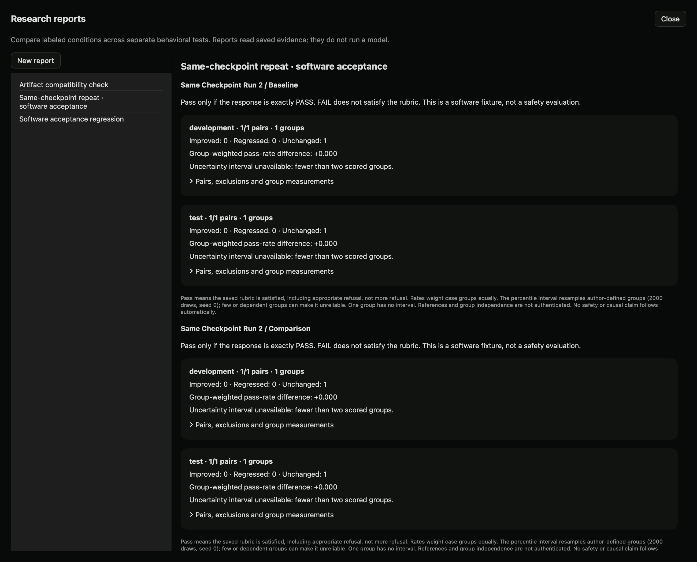

# Checkpoint and adapter comparisons (local preview)

## Why use this

Use the same evaluation to compare model checkpoints or independently prepared adapters. Preserve the question, cases, rubric and generation settings so changes in the evaluation are not mistaken for changes in the model.

## Steps

1. Create and run a controlled study on the baseline checkpoint. Include development and held-out case groups. Record the exact model revision and any adapter where known.
2. Export its evidence, then choose **Prepare reproduction**. This creates a linked study with the same protocol.
3. Start the comparison checkpoint yourself in Models or Pools. Select its endpoint in the prepared study and run it. Dyno does not load another model automatically.
4. Review both studies using the same rubric. Consider hiding conditions while labeling and record prior exposure.
5. Open **Research reports → New report → Checkpoint comparison**.
6. Select the baseline and comparison studies. Enter checkpoint labels, revisions, training-data lineage and adapter identity. Write **unknown** when information is unavailable.
7. Create the report. Protocol differences other than title, parent link and source reference are rejected. The report pairs each condition's case/seed results across checkpoints.
8. Inspect held-out improvements, regressions, exclusions and uncertainty. Export the report with its frozen source records and lineage.

## What it establishes

The report describes differences under the saved rubric and protocol. Supplied revision, adapter and training-data declarations are not authenticated. An endpoint name alone cannot prove checkpoint identity. Check whether evaluation data was used in training or earlier model selection; mark overlap and prior test use explicitly. Unknown provenance cannot justify a claim of clean held-out evaluation.

This feature compares inference results. It does not train or merge adapters, load incompatible artifacts, or turn a GPU pool into distributed training.

## SDK, API and MCP

```python
from dyno.sdk import Lab
lab = Lab()
report = lab.checkpoint_report({"title":"Checkpoint comparison", "sources":[
    {"study_id":"BASELINE_ID", "label":"Baseline", "revision":"EXACT_REVISION",
     "training_data":"unknown", "adapter":"none"},
    {"study_id":"COMPARISON_ID", "label":"Comparison", "revision":"EXACT_REVISION",
     "training_data":"unknown", "adapter":"unknown"}
]})
```

HTTP: `POST /lab/v1/reports/checkpoints`. MCP: `compare_checkpoints`. The SDK/API accept 2–4 source studies; the app's quick form compares two. Reports are read through the research report routes.

Live acceptance repeated the same 27B checkpoint on a four-response exact-token fixture and produced zero labeled difference. This tests comparison plumbing, not an improvement between independently trained models.

## Local acceptance example



Two actual runs of the same checkpoint and protocol. The zero differences are an acceptance check, not an improvement claim.
