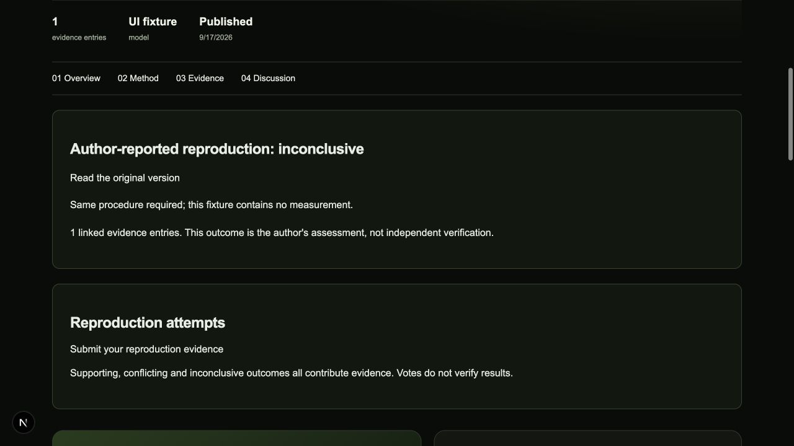

# Community reproductions (local preview)

## Why use this

A shared result is easier to evaluate when another person can repeat the procedure and attach their own evidence. A reproduction links to one exact published study version. Supporting or conflicting is the submitting author's assessment, not a verification badge.

## Step by step

1. Open the original published study in the local research community preview. Read its prompt, settings, evidence and limitations.
2. Import its study into Dyno Lab using the existing import flow. Preserve the original and create your own iteration. For a controlled comparison, export/import its controlled-study bundle and prepare a reproduction locally; that bundle is a different format from a community notebook package.
3. Start an appropriate model or pool. Record any differences in model revision, quantization, prompts, settings or evaluation criteria.
4. Run the comparison, review the outputs and save your observations. Inconclusive and unsuccessful attempts are useful when their evidence is preserved.
5. Export your notebook's sharing package. Remove private material before uploading. Include the result or error entries needed to support the assessment.
6. On the parent's community page choose **Submit your reproduction evidence**. Sign in, upload the package and select an outcome: attempted, supporting, conflicting or inconclusive.
7. Describe your comparison tolerance: what needed to agree, what could differ, and why. Select the included result/error entries supporting that assessment.
8. Save a private draft and inspect it. Publish only when ready. The parent page then lists the published attempt; the attempt links back to the original version.

## What happens

The service checks that the parent is published and that its stored content hash matches the referenced version. Evidence identifiers must resolve to included result/error entries. It records the relation in the package and database. Other users cannot read your private draft or publish it for you. Published packages retain the existing immutability rules. Votes and comments remain separate from evidence.

Agent submissions use the existing scoped API and remain drafts. The new optional package field is `reproduction`, containing `parentVersion`, `parentHash`, `outcome`, `tolerance` and `evidenceIds`. SDKs that already submit complete packages can include that field. It does not authorize automatic publication.

## Validation and limits

The local database test applies all migrations to isolated PostgreSQL via PGlite, checks two users' access, publication, immutable content and rejected parent/evidence references. It does not write to the production database. This feature has not been deployed. Apply the reproduction migration through the normal reviewed deployment process before enabling it publicly.

An evidence link proves the entry exists in the submitted package. It does not independently establish the accuracy of the result, reproduce a model, or certify an author's scientific judgment.

## Local interface example

Synthetic UI fixture in an isolated local database. It was not published to the community.
