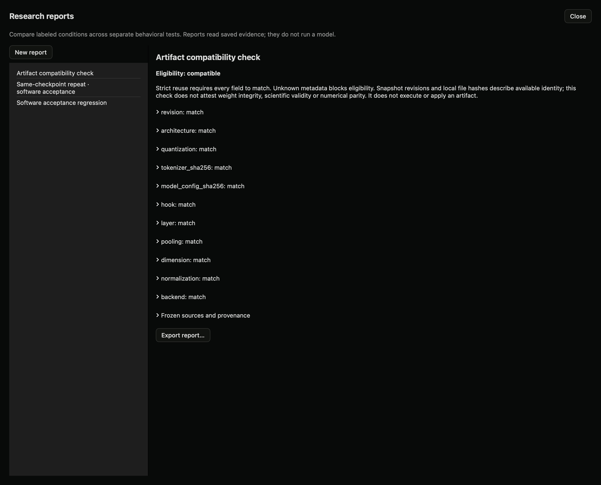

# Artifact compatibility checks (local preview)

## Why use this

A probe trained on one model representation cannot safely be assumed to work on another. Matching model names alone is insufficient. Differences in tokenization, quantization, layers or normalization can change the meaning of its inputs.

## Steps

1. Run grouped-probe jobs for the source and target models. New jobs save a fingerprint beside the trained probe. Earlier jobs may not have this metadata.
2. Open **Lab → Studies → Controlled comparisons → Research reports** and create a new report.
3. Set report type to **Artifact compatibility**. Select the source and target completed jobs.
4. Choose **Check and save compatibility**. This reads saved metadata. It neither loads a model nor applies a probe.
5. Review each field. **Compatible** requires all required fields to match. **Mismatch** identifies differences. **Unknown** means information needed to decide is absent, so strict eligibility is denied.
6. Export the report if another researcher needs the comparison.

## What is checked

Snapshot revision, architecture, quantization, tokenizer file hashes, model configuration hash, hook, layer, token pooling, hidden dimension, normalization and backend. Missing values are never silently accepted. Local snapshot paths provide revision identity when available; other model paths may have unknown revisions. A compatible result does not attest the weight files, prove behavioral equivalence, or establish scientific validity. Cross-model artifact application is not provided by this checker.

## SDK and API

```python
from dyno.sdk import Lab
lab = Lab()
report = lab.compatibility_report("SOURCE_JOB_ID", "TARGET_JOB_ID")
print(report["compatibility"]["status"])
```

HTTP: `POST /lab/v1/reports/compatibility` with `source_job_id` and `target_job_id`. MCP: `check_artifact_compatibility`. Stored reports use the same read/export workflow as regression reports.

## Local acceptance example



The newly trained 27B grouped probe compared with its own recorded contract. This checks metadata eligibility, not cross-model transfer.
