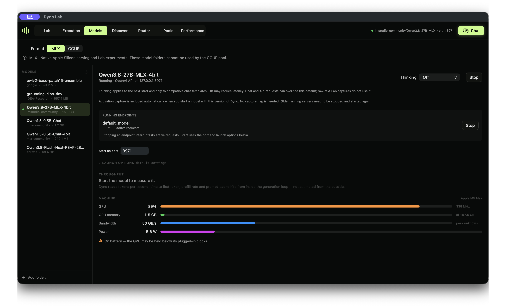
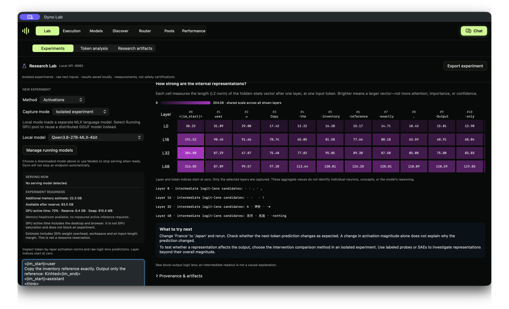

# Your first experiment in Dyno Lab

**Goal:** run a model, inspect one real request, and save an activation map. You only need an Apple Silicon Mac. A GPU pool, Python and the SDK are optional.

This guide uses the published [Dyno Lab 0.3.0 release](https://github.com/canivel/dynolab/releases/tag/v0.3.0). Allow time to download a model first; download size and available memory vary considerably.

[Download for Mac](https://github.com/canivel/dynolab/releases/latest) · [Full app handbook](https://dynolab.dev/guide.html) · [Get help](https://github.com/canivel/dynolab/issues/new/choose)

## 1. Install and choose a model

1. Download the asset ending in **arm64.dmg**, open it and drag **Dyno** into **Applications**. Requires macOS 14 or newer on an M-series Mac.
2. Open Dyno from Applications. The main window opens on launch; the menu bar icon lets you reopen it later.
3. In **Discover**, select **MLX** and search for a small language model compatible with MLX. Check the listed download size and leave memory for macOS and runtime workspace. If you already have a downloaded MLX model, use that one.
4. Wait for the download to finish. In **Models**, select the downloaded model, choose **Thinking → Off** if supported, and click **Start**. Wait for the running endpoint to appear.

Choose MLX for this first session. GGUF models use the [experimental pool workflow](pool-guide.md); selecting a GGUF does not convert it into an MLX model.



*An actual Qwen3.8-27B session. This screenshot illustrates the controls; a 27B model is not required for this introduction. Start with a smaller model if needed.*

## 2. Ask a question and see the request

Open **Chat**, select your running model, and send:

```text
Copy the inventory reference exactly. Output only the reference: Kinhted
```

Read the answer, then open **Execution** and select the completed request. You should see the input and output. Keep the original response even if it is correct: this is an observation, not a test that must fail.


*In this recorded Qwen3.8 request, the model returned `ded` for `Kinhted`. Your model or settings may produce a different answer. The screenshot is evidence of this request, not a claim about every model.*

No thinking block is required for this experiment. Model-emitted thinking is generated text; it is not a direct readout of the internal computation.

## 3. Capture an activation map

1. Open **Lab → Experiments** and choose **Activations**.
2. Choose **Inspect serving model** and select the endpoint you started. Refresh the endpoint if needed.
3. Enter the same reference-copy prompt above.
4. Expand **Edit layers, settings & examples**. Set the `layers` setting to `[0, 1]` and `max_input_tokens` to `128`. Layer numbers start at zero; the selected model must have at least two blocks.
5. Read **Experiment readiness**, then click **Run experiment**. Keep other requests idle while it runs.

Resident capture reuses the loaded model rather than loading another copy. It still needs workspace and can briefly delay inference. This is a **new raw-text forward pass**, not a trace of the earlier Chat request: Chat adds a template and potentially system text. Do not treat the two inputs as identical.



*This recorded study used its exact serialized prompt and four selected layers. Your first capture uses two layers and will look different. The reproducible study below supplies its own complete configuration.*

Each cell measures the magnitude of one token's block-output vector at one layer. A brighter cell means a larger vector, not greater importance, attention, or evidence of a safety concept. Next-token candidates, when shown, describe possible next tokens rather than a complete answer.

## 4. Change one thing, then reopen the results

Replace `Kinhted` with `Invoice42`, run another capture, and compare the measurements. Keep the model, layers and other settings the same. Different tokenization can change the grid's shape as well as its values.

Open **Saved activation captures** and select the first result to restore its settings and measurements. Captures save automatically on this Mac; export the result if you want to share it. Reading a saved result does not require loading the model, but rerunning does.

You have completed the first session when you can:

- Find your request and answer in Execution.
- Explain what a heatmap cell measures, and what it does not tell you.
- Reopen both saved captures.

When finished, stop your model using **Models → Stop** to release its allocation.

## If something stops you

| What you see | What to do |
| --- | --- |
| No model in Models | Wait for the download, refresh the library, and confirm you selected MLX. |
| No serving endpoint | Start the downloaded model in Models, wait for loading, then refresh the Lab endpoint list. |
| Run experiment is unavailable | Check that Activations, resident capture and a supported running endpoint are selected. Read the nearby validation message. |
| Insufficient memory | Start a smaller model or close another workload. A model that fits for serving still needs capture workspace. |
| Endpoint does not support capture | Confirm this is a Dyno MLX endpoint. If it was started before an app update, stop it and start it again from the updated app. |
| You cannot reopen a capture | Include the app version and what you clicked in a [bug report](https://github.com/canivel/dynolab/issues/new/choose). Do not include private prompts or credentials. |

## Next: can a probe predict a copying failure?

The [Qwen3.8 identifier-fidelity study](../examples/identifier-fidelity-probe/README.md) goes beyond this introduction: 72 recorded responses, held-out identifiers, a layer-32 probe, and input-only control baselines. It includes the model revision, settings, actual outputs and saved artifacts. Use those instructions to reproduce the study; this short raw-text exercise does not reproduce its numerical results.

The small held-out set caught seven missing-reference outcomes with two false alarms. A token-count baseline also performed well. It is an exploratory robustness experiment, not a validated safety monitor.

[Watch the results walkthrough](https://dynolab.dev/probe-example.html) · [Full handbook](https://dynolab.dev/guide.html) · [Pool setup](pool-guide.md) · [Python SDK](sdk-guide.md)
