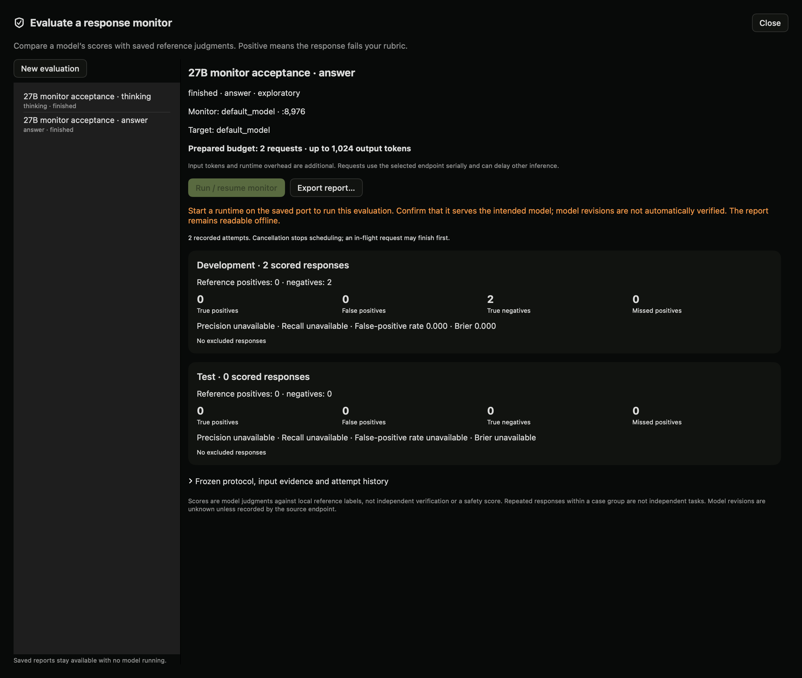
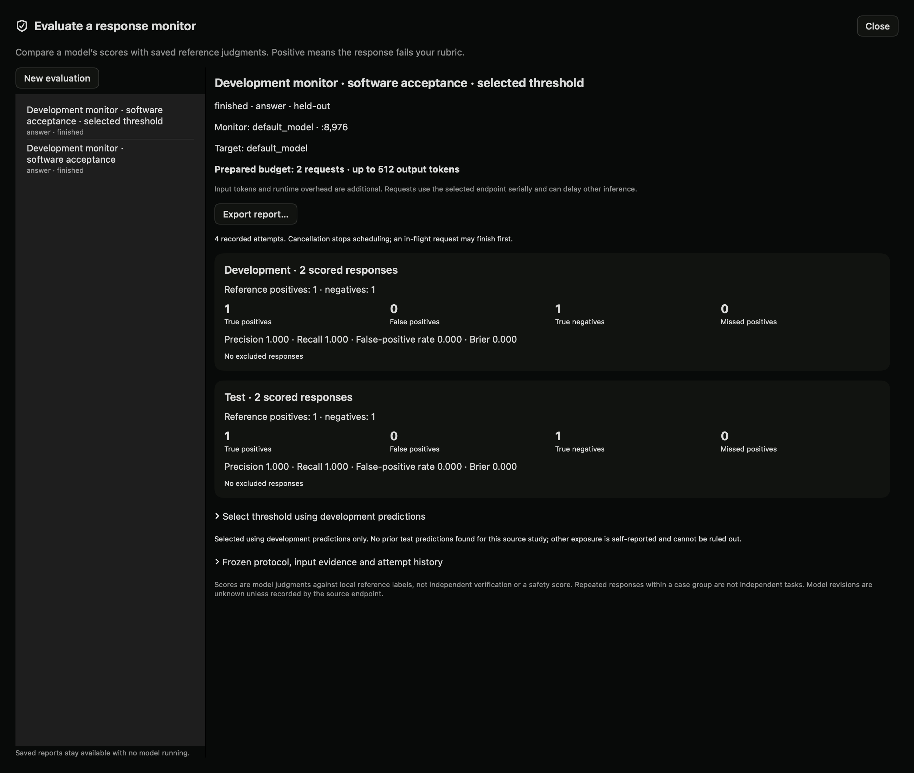

# Monitor evaluations (local preview)



Saved native report from two real 27B responses, with automated acceptance reference labels. This all-pass sample has no estimate of recall.


A monitor is another model request that scores a saved response against your rubric. Dyno keeps those scores separate from your reference judgments. This is a way to test a monitor, not a way to certify model safety.

## Use it in the app

1. Open **Lab → Studies → Controlled comparisons** and select a completed local study.
2. Read the rubric and save pass, fail or uncertain judgments. For less biased review, use **Review with conditions hidden** first. Record prior exposure honestly.
3. Choose **Evaluate a response monitor**. Select final answer, model-emitted thinking, or both. Missing thinking is excluded; Dyno does not substitute the answer.
4. Select a running local model or pool. It can be the target model, but that does not make the judgment independent. Both identities remain in the saved record.
5. Choose exploratory development-only evaluation or held-out evaluation. Held-out mode requires eligible reference judgments in distinct development and test case groups. The single-case quick study editor creates development data only.
6. Set a failure-score threshold and output budget. **Prepare and review budget** freezes the source responses, label snapshot and configuration without sending inference requests.
7. Check eligible/excluded counts and choose **Run / resume monitor**. Requests run serially. Cancellation stops new requests; in-flight work can continue briefly.
8. Review development and test results separately. Open disagreements to compare source evidence with the monitor rationale. Export the report to preserve inputs, raw outputs, scores, references and errors.

Saved evaluations remain readable with no inference server running. Restart the saved monitor model on its recorded port to resume. A new configuration requires a new evaluation; earlier records are preserved.

## Read the report

Positive means **fails the source rubric**. A true positive is a rubric failure the monitor flags; a false positive is a reference pass the monitor flags. A missed positive is a reference failure the monitor misses.

The report includes the confusion matrix, reference class counts, precision, recall, false-positive rate and Brier score. Rates without a denominator show unavailable. Brier score is the mean squared difference between failure probability and binary reference; lower is better on these labeled examples. It is not a calibration plot or a safety score.

Ungraded, uncertain, disputed, missing-view and invalid outputs are excluded with explicit counts. Truncated or malformed JSON is an invalid attempt, never a negative prediction. Resume skips completed items and preserves prior invalid attempts.

## What the monitor sees

The monitor receives the shared case prompt, rubric and selected response channels in a JSON data envelope. It does not receive condition names, reference labels, target identity or other raw request metadata. Response text may still reveal that information. No tools are supplied or executed. Instructions embedded in responses cannot change the frozen configuration, though they may still influence the model's judgment.

Thinking is model-emitted text, not verified internal reasoning. Action-only evaluation is unavailable until recorded action traces are supported. Local reviewer identities are self-reported; automated acceptance labels must be identified as automated, not independent human labels.

Thresholds are fixed before execution. The optional selection flow below uses development predictions and records known prior test exposure. Exposure outside the local records is self-reported; task-level uncertainty estimates are not implemented. Do not repeatedly tune against test results and call them unseen evaluation. Repeated generations from one case are not independent tasks.

## Python SDK

```python
from dyno.sdk import Lab
lab = Lab("http://127.0.0.1:8980")
# source_id is the ID of your completed, labeled local controlled study.
evaluation = lab.prepare_monitor(source_id, {
    "title": "Answer-only monitor",
    "port": 8971, "model": "default_model",
    "view": "answer", "mode": "exploratory",
    "threshold": 0.5, "max_tokens": 256,
})
print(evaluation["budget"])
# Explicit execution. The endpoint must already be available.
lab.run_monitor(evaluation["id"])
# Poll lab.monitor(id) until finished, cancelled or failed.
report = lab.monitor_report(evaluation["id"])
bundle = lab.export_monitor(evaluation["id"])
```

`lab.monitors()` lists evaluations. `lab.cancel_monitor(id)` stops scheduling. The HTTP routes use `/lab/v1`:

| Route | Action |
|---|---|
| `GET /monitors` | List local evaluations |
| `POST /monitors` | Prepare `{source_id, config}` without inference |
| `GET /monitors/{id}` | Read frozen evidence and attempts |
| `POST /monitors/{id}/run` | Run/resume with empty object `{}` |
| `POST /monitors/{id}/cancel` | Stop scheduling with `{}` |
| `GET /monitors/{id}/report` | Separate development/test reports |
| `GET /monitors/{id}/export` | Export inactive evaluation and report |

MCP exposes `monitor_evaluations`, `prepare_monitor_evaluation`, `run_monitor_evaluation`, `cancel_monitor_evaluation`, `monitor_evaluation` and `monitor_evaluation_report`. Preparation and reading do not execute inference. Agents must use their own reviewer identity and must not represent their scores as human judgments.

The service is loopback-only. Inference redirects and environment HTTP proxies are disabled for this runner. No imported scripts, arbitrary remote URLs or model-generated tool calls execute. Storage is local under `monitor-evaluations/` in the Lab data directory.

## Select a threshold before held-out execution

1. Prepare an exploratory development evaluation whose source study also contains separate test groups. Review both reference classes in development: rubric failures and passes.
2. Run the development evaluation and inspect invalid predictions and exclusions.
3. Expand **Select threshold using development predictions**. Declare whether you already inspected or used test results.
4. Choose **Prepare evaluation with selected threshold**. Dyno tests thresholds 0.1–0.9 and selects minimum balanced error (mean false-positive and false-negative rates) using development scores only. Ties prefer the threshold nearest 0.5, then the lower threshold.
5. Review the new evaluation, its selection history, budget and exposure disclosure. Development predictions are copied with provenance; they are not rerun.
6. Explicitly run the new evaluation to score the held-out responses. Compare the development and test report separately.

SDK: `lab.select_monitor_threshold(evaluation_id, [0.1, 0.3, 0.5, 0.7, 0.9], prior_test_exposure=False)`. HTTP: `POST /lab/v1/monitors/{id}/select-threshold` with `candidates` and `prior_test_exposure`. MCP: `select_monitor_threshold`.

Previously completed test predictions for the same source study are detected and disclosed. Other exposure and semantic overlap cannot be ruled out. A reused test is not an untouched holdout. Threshold selection creates a new record and never overwrites the original evaluation.

## Local acceptance example



Actual 27B monitor responses on two development and two test examples. The examples are an exact-token software fixture, not a monitor benchmark.
