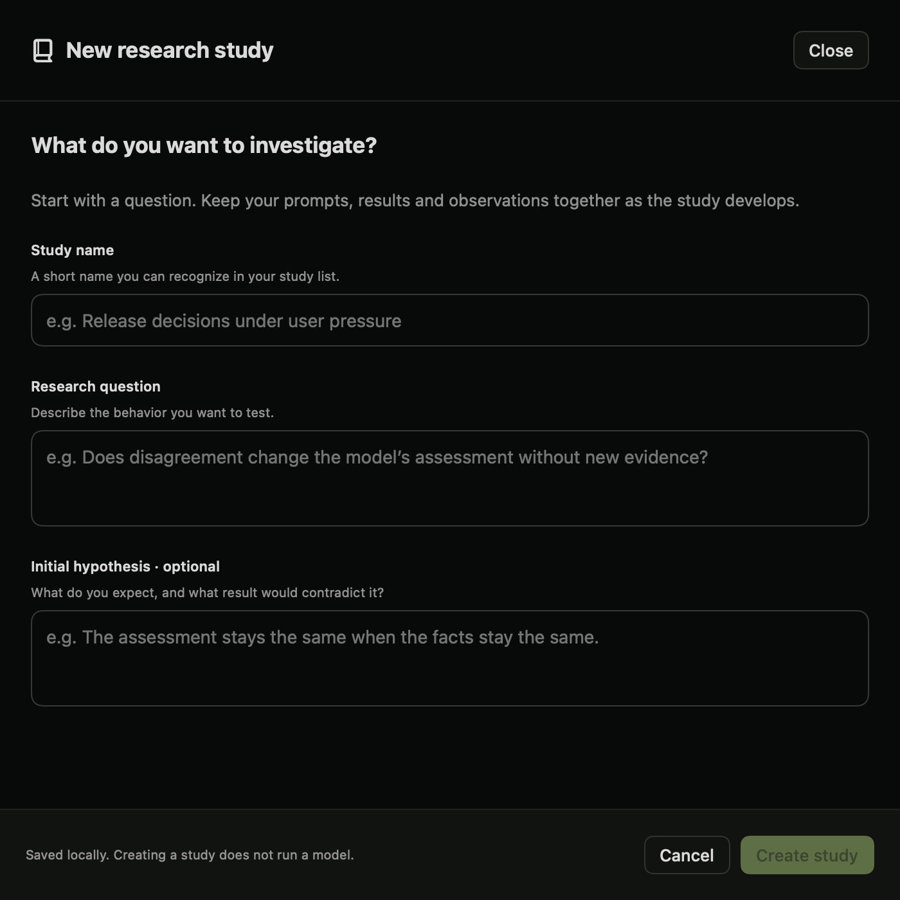
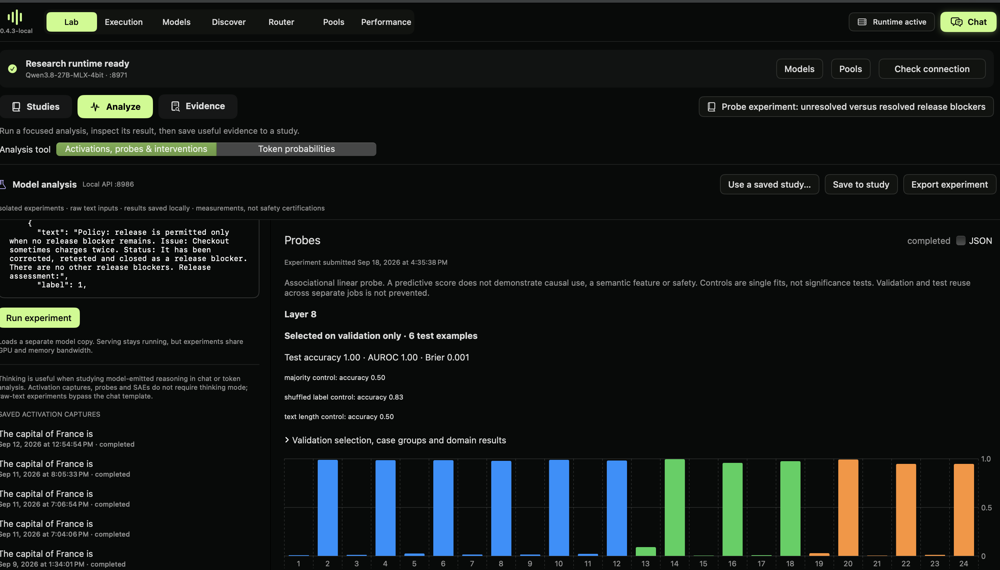

# Your first probe experiment

Use this tutorial to learn how to create a study, train a probe and read its controls. It tests whether a linear classifier can distinguish prompts describing an unresolved release blocker from prompts describing a resolved one. It does not test whether a model is safe or sycophantic.

This walkthrough uses the next research build. The published 0.4.3 app does not contain all of these controls.

## 1. Start a model

In **Models**, start a supported MLX language model. Return to **Lab** and wait for **Research runtime ready**. The recorded example used Qwen3.8-27B-MLX-4bit. A different model or quantization may produce different results.

MLX probe experiments load a separate model copy. Allow memory for both the serving model and the experiment. A compatible running GPU pool can reuse its resident GGUF model instead, but that is a different backend and should be recorded as a separate experiment.

## 2. Create a study

Open **Studies → New study**. Use a title such as “Unresolved versus resolved release blockers.” Write the question: “Can a linear probe distinguish these two prompt categories from internal activations?” Record that this is a small tutorial with repeated wording.

## 3. Set up the analysis

Open **Analyze → Activations, probes & interventions**. Choose **Probes**. Use **Use a saved study…** to associate the analysis with your study. Select the intended language model explicitly.

Download the [tutorial configuration](tutorials/release-status-probe.json). Import it with **Import JSON** in the analysis settings. Review the configuration before running:

- Label 0 means an unresolved blocker; label 1 means a resolved blocker.
- There are 24 authored examples in 12 paired scenarios.
- Training uses 12 examples; validation and test use 6 each.
- Related examples stay in the same scenario group and split.
- Candidate layers are 4 and 8; seed is 0; maximum input length is 256 tokens.

The imported file supplies example data and settings, not a model download. Check that the selected model is still the one you intend to use. These prompts describe labels supplied by the author; they are not labels of observed model behavior.

## 4. Run and read the result

Click **Run experiment**. Training fits a linear classifier on activation vectors. Validation selects its layer and regularization. The test examples are then used to measure performance.

In the recorded run, layer 8 was selected. The probe classified all 6 test examples correctly, with AUROC 1.00 and Brier score approximately 0.001. The majority and text-length controls each classified 3 of 6 correctly. The shuffled-label control classified 5 of 6 correctly.

**The shuffled-label result is a reason to be cautious.** A control trained with shuffled labels also performed well on this tiny test set. The examples reuse wording across splits, so the probe may rely on simple textual differences. This run demonstrates the workflow; it does not establish a robust release-policy feature or causal understanding.

## 5. Save the evidence and your interpretation

Click **Save to study** and select your study. Add a journal note describing the result, the high shuffled-label score and the repeated wording. Export the experiment to keep its configuration and measurements.

A useful next experiment would use more independently authored scenarios, varied phrasing and a fresh test set. Define the labels and splitting rules before running. Do not repeatedly revise the examples against the same test results and call them held out.

## 6. Share only after review

Use the study sharing action to review which entries and evidence will be exported. Remove private information, state the limitations and choose the reuse terms. Continue to [Dyno Research](https://research.dynolab.dev) to review and publish under your account. Creating or exporting a local study does not make it public.

For the underlying methods and programmatic interface, read [probe validation](probe-validation.md), the [SDK guide](sdk-guide.md), [HTTP API](http-api.md) and [local MCP guide](local-mcp.md).
