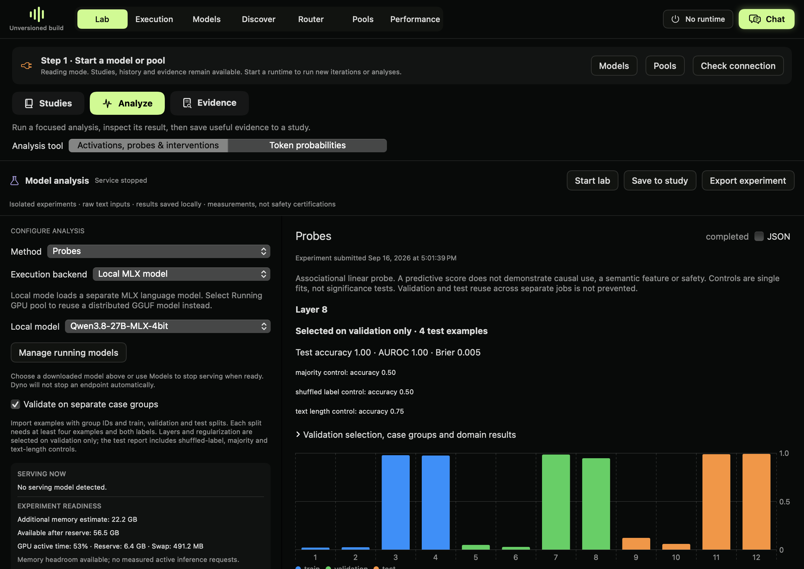

# Grouped probe validation (local preview)



Native result from the 12-example software fixture described below. Four test examples are too few for a generalization claim.


A linear probe measures whether a label can be predicted from a model representation. It does not establish that the model uses that representation to make a decision, or that the model is safe.

For a complete worked example, use [Your first probe experiment](probe-tutorial.md).

## Run in the app

1. Open **Lab → Analyze** and select **Probes**.
2. Select a supported MLX model or a running pool with activation capture. MLX jobs use a separate model allocation; pool capture reuses its resident weights.
3. Enable **Validate on separate case groups**. Import examples with `text`, binary `label`, `group`, and `split`. The splits are `train`, `validation`, and `test`.
4. Keep related examples in the same group and split. Each split needs at least four examples and both labels. This minimum is for software operation, not sufficient evidence for a research claim.
5. Select candidate layers and run. Dyno fits normalization on training data, selects a layer and regularization using validation Brier score, then reports the test result.
6. Inspect the shuffled-label, majority and text-length controls alongside the probe. Export the result and probe artifact to preserve the configuration.

Repeated normalized text and group IDs cannot cross splits. This cannot detect all semantic overlap. You must choose meaningful groups and avoid reusing test data to revise the study.

## SDK and API

```python
from dyno.sdk import Lab

lab = Lab()
# examples is your reviewed list of training, validation and test records.
job = lab.probe(
    model="/path/to/downloaded/model", examples=examples,
    probe_validation=True, layers=[4, 8], max_input_tokens=256, seed=0,
)
result = lab.job(job["id"])
```

For a resident pool, use `lab.submit_pool("probe", model, pool_port=8978, examples=examples, probe_validation=True, layers=[4, 8])`. The same configuration is accepted by `POST /lab/v1/jobs` and the existing MCP probe job tool.

An example record is:

```json
{"text":"Your reviewed example", "label":1, "group":"scenario-17", "split":"test", "domain":"held-out domain"}
```

The result includes every validation candidate, test class counts, accuracy, AUC, Brier score, controls, domain subsets and per-example scores. AUC is unavailable for a subset without both classes. Domain labels are supplied by the author and are not automatically verified.

`probe-contract.json` records the requested model/revision, configuration, hook, layer, vector dimension, normalization, dataset hash and artifact hash. This is provenance, not a guarantee that the artifact is compatible with another model. Automatic cross-model application is not provided by this workflow.

## Local acceptance check

The downloaded 27B four-bit model completed a 12-example negation fixture, with four examples per split and candidate layers 4 and 8. Layer 8 was selected on validation data. On four test examples the probe scored 4/4, the single shuffled-label and majority controls 2/4, and text length 3/4. These are software acceptance results on a deliberately simple fixture. They are not a safety finding, a calibrated estimate of generalization, or a claim that a negation circuit was discovered.

The shuffled-label control is one fit, not a permutation significance test. Test reuse across separate jobs is not prevented. Interventions, causal claims and external artifact compatibility need their own validation.

## Intervention controls

For an intervention comparison, enable **Include intervention controls**, or pass `intervention_controls=True` to `lab.compare`. The default is three random directions; `control_repeats` accepts 1–5. Controlled jobs accept at most 24 prompt/strength pairs.

Each trial records a no-op pass, a restored baseline and random directions matched to the initial perturbation's L2 norm. Random controls preserve activation dtype. They compare the same input prefix and target token; they do not generate continuations. Direction seeds are recorded. Quantization and activation precision can change the effective perturbation after rounding.

The live 27B check used scale 1.0 and 0.9 at layer 4. The identity condition, zero-magnitude random controls, no-op and restored passes had zero observed difference. This establishes that this local check passed, not a tolerance guarantee for every backend. A complete behavioral regression suite and repeated prompt studies remain separate work.
