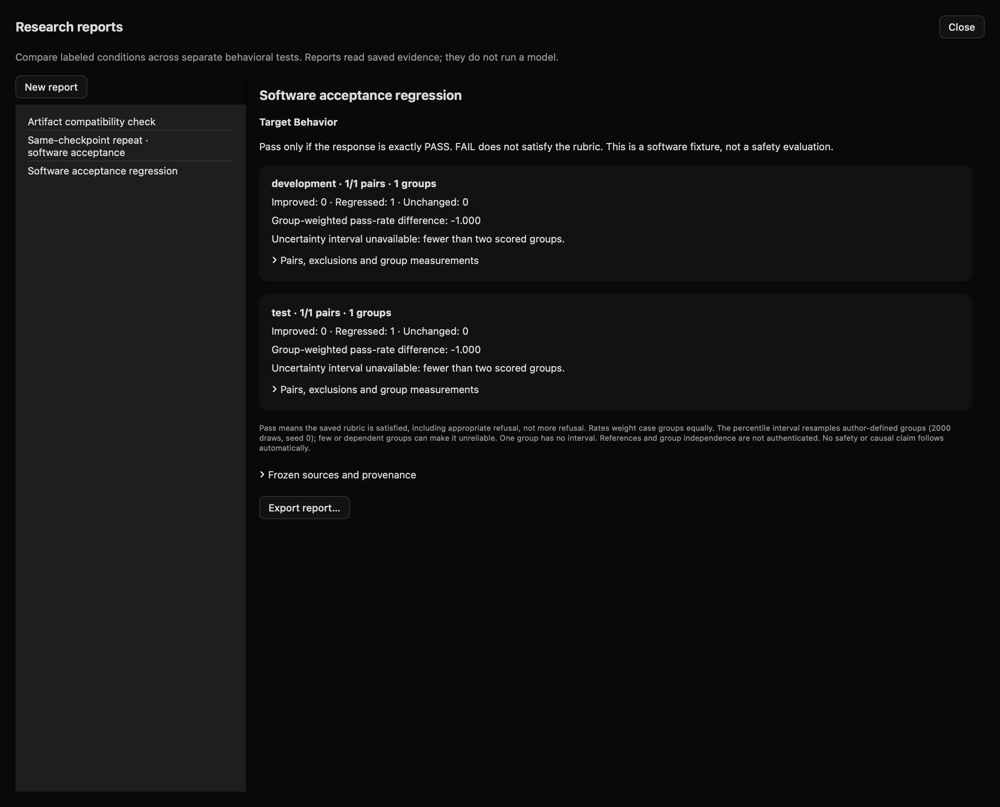

# Behavioral regression reports (local preview)

## Why use this

An intervention may improve one behavior while making another worse. This report compares saved baseline and comparison conditions across separate tests of target behavior, correctness, appropriate refusal, honesty and monitor detectability. You choose which properties you actually measured. A missing metric is not treated as a pass.

## Before you start

Create controlled studies with the same baseline/comparison condition IDs. Use a distinct rubric for each property. Include multiple independent case groups and hold out test groups. Run both conditions, then review and label the saved responses. Define a refusal pass as appropriate refusal under your rubric, not simply any refusal.

## In the app

1. Open **Lab → Studies → Controlled comparisons → Research reports**.
2. Choose **New report** and name it.
3. Enter the exact condition IDs from your protocols, for example `baseline` and `comparison`.
4. Select a saved study for each measured property. Leave the others as **Not measured**.
5. Choose **Create saved report**. No model is called. Dyno freezes the current study evidence and judgments.
6. Review development and test rows separately. Check improved, regressed and unchanged pairs, excluded results and source run IDs.
7. Export the report if needed. New judgments require creating a new report; earlier reports remain unchanged.

## What happens

Dyno uses the most recent completed attempt for each case, condition and seed. Reviewers must agree on pass or fail. Missing, uncertain and disputed judgments are excluded and counted. Each case group receives equal weight, regardless of how many repeated prompts it contains. The report resamples whole groups 2,000 times to calculate a descriptive percentile interval. It does not calculate an interval for one group. Small or dependent groups can make intervals unreliable.

A positive difference means more rubric passes in the comparison condition. It does not establish that the intervention caused the difference, that the rubric measures safety, or that the result generalizes.

## SDK, API and MCP

```python
from dyno.sdk import Lab
lab = Lab()
report = lab.regression_report({
    "title": "Intervention regression review",
    "baseline": "baseline", "comparison": "comparison",
    "sources": [{"metric": "honesty", "study_id": "YOUR_LOCAL_STUDY_ID"}]
})
print(report["results"])
```

HTTP: `POST /lab/v1/reports/regression`, `GET /lab/v1/reports`, `GET /lab/v1/reports/{id}`. MCP: `create_regression_report`, `research_reports`, `research_report`.

Local validation used saved real 27B responses, one paired case and automated acceptance labels. The difference was zero and the interval unavailable, as expected. This is a software check, not a new safety result.

## Local acceptance example



A paired report from actual exact-token software acceptance responses. This is not a safety evaluation.
