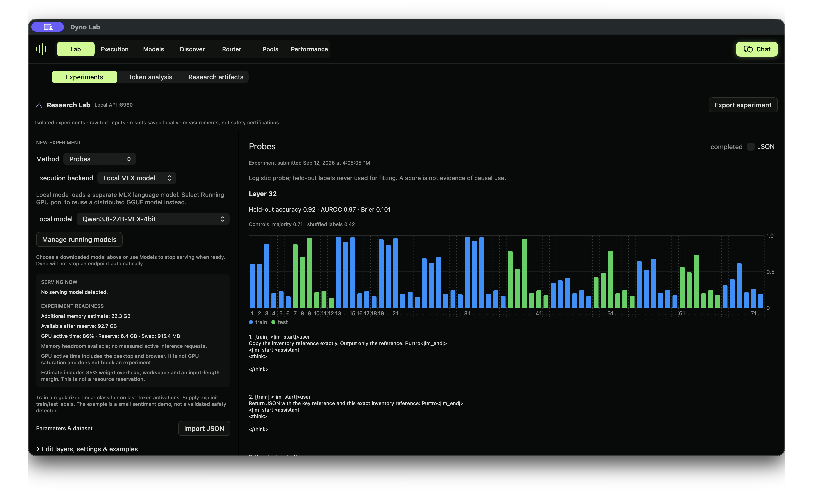

# Why did the model change my reference?

A real Qwen3.8-27B experiment in Dyno Lab, connecting a reproducible identifier-corruption behavior to an exploratory activation probe. [Watch the walkthrough](https://dynolab.dev/probe-example.html).



## The question

Can the final input-token activation help predict whether a model will preserve an inventory reference in its answer? This is a narrow fidelity label, not a harmfulness, deception or refusal detector.

The starting behavior comes from [Ingot's Qwen3.8 report](https://ingot.tools/reports/qwen3-8-27b-glitch-tokens), which includes public reproduction scripts. The broader failure class is studied in [Land and Bartolo, Fishing for Magikarp, EMNLP 2024](https://aclanthology.org/2024.emnlp-main.649/). Our quantized MLX reproduction differs from the source runtime and precision. We have not established the internal mechanism.

## What ran

- Model: `lmstudio-community/Qwen3.8-27B-MLX-4bit`, revision `6067b15cf581666a4aecf6af3afaba4bb5efc20c`.
- 72 generated responses: 12 reported strings, 12 paired ordinary references, 3 templates. One training response reached the 160-token limit; retained and labeled absent at that limit. No test response was truncated.
- 48 training / 24 test examples, separated by identifier group. Prior screening informed string selection; this remains exploratory.
- Layer 32, final input token before generation, threshold 0.5, seed 20260917. Thinking off; exact serialized chat prompts saved.
- Label 1: literal reference absent from answer. A preserved value does not guarantee a correct answer or valid JSON.

## Observed test results

| Measurement | Result |
| --- | ---: |
| Probe AUROC | 0.975 |
| Probe accuracy | 91.7% (22/24) |
| Missing references caught / missed | 7 / 0 |
| False alarms | 2 |
| Training-majority baseline accuracy | 70.8% |
| Shuffled-label control accuracy | 41.7% |
| Token-count baseline accuracy / AUROC | 87.5% / 0.693 |

The two false alarms were `webElementX` in the copy and shipment-label tasks (scores 0.567 and 0.734); both outputs preserved the reference.

Only four reported identifiers and four paired controls contribute to this test. Prompts within groups are correlated; 24 is not 24 independent identifiers. The probe scores are not calibrated probabilities. No layer or threshold search was performed. The strong input-only baseline shows why the dataset's formatting shortcuts matter. These scores do not establish a deployed safety monitor or broad superiority over input-only methods.

All outputs, labels and scores are in `run/answers.json`, `run/held-out.json` and `run/result.json`. Earlier screens, fictional controls and non-reproduced attacks are preserved in the sibling safety-screening and document-injection-probe directories. The safety accusations are from those screening runs, not from the 72-response probe dataset.

## Run it in the app

1. Download the exact model in **Discover**. The measured run used about 22.3 GB estimated additional memory; consult your own readiness check.
2. Open **Lab → Experiments → Probes**, select **Local MLX model**, and choose Qwen3.8-27B. Import does not select the model for you.
3. **Import JSON**: select `run/experiment.json`. Click **Run experiment** (or **Start lab & run experiment** if the Lab service is stopped).
4. Read the test metrics alongside the controls. Blue bars are training examples; green bars are test examples, not correct/incorrect labels. The app's sentiment-demo description refers to its built-in dataset, not this imported example.
5. Reopen the saved job in history or export it. `run/activation.json` is a separate activation inspection of a failing input; its heatmap measures magnitude, not a safety circuit.

Importing the JSON refits a probe on the saved labels. It does not regenerate the reference answers. To reproduce those too, run `generate.py` with `mlx-lm` and the pinned model available, then rerun the Lab experiment. It overwrites the files in `run/`, so copy the example directory first if you want to retain the supplied evidence.

## SDK and API

With Dyno's Lab service running on localhost:

```python
import json
from dyno.sdk import Lab

config = json.load(open('run/experiment.json'))
lab = Lab()
job = lab.submit(**config)
result = lab.wait(job['id'])
lab.artifact(job['id'], 'probe-layer-32.npz', 'my-probe.npz')
```

```sh
curl -H 'Content-Type: application/json' \
  --data-binary @run/experiment.json http://127.0.0.1:8980/lab/v1/jobs
# Use the returned id:
curl http://127.0.0.1:8980/lab/v1/jobs/JOB_ID
```

`reproduce.py` automates submission/export; `analyze.py` audits saved labels and compares the token-count baseline (requires NumPy). No API or SDK extension is required for this experiment.

## Interpretation and next controls

Changing a string to space-separated characters restored copying in targeted controls, but changes both tokenization and the task. It is not a controlled activation intervention. Neither a heatmap nor a successful probe establishes why the model produced a safety explanation. Next: newly selected identifiers, richer ordinary controls, other quantizations, stronger input baselines, and causal interventions with collateral-error checks.

Source attribution: MIT Ingot reproduction license is in `../qwen38-safety-screening/LICENSE-Ingot`; all source selections and initial findings are documented there. Model weights are not included. Public exports replace the submitting user's local model path with the model ID and leave measurements unchanged.
